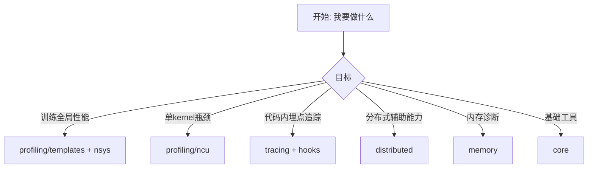

# my_utils

面向 PyTorch 训练/推理工作流的实用工具集，核心覆盖：

- 性能采集与分析（NSYS / NCU / 统一 metrics）
- 运行时追踪与 Hook（NVTX / module hooks）
- 分布式辅助（时钟同步 / etcd barrier / sequence parallel padding）
- 内存诊断（snapshot / OOM flag / GPU tracker）
- 产物落盘与离线分析（dump / CSV）

## 30秒定位



## 安装

```bash
cd my_utils
pip install -e .
```

可选依赖（按需）：

```bash
pip install -e .[profiling,tensordict,etcd,nvml,nvtx,system,megatron]
```

常用组合：

```bash
# 仅安装 my_utils，不动你现有 torch/cuDNN 环境
pip install -e .

# 安装所有可选依赖（不含 torch）
pip install -e .[all]

# 安装所有可选依赖（含 torch）
pip install -e .[all_with_torch]
```

## 一眼可用命令（最常用）

NSYS 快速采集：

```bash
bash my_utils/profiling/templates/run_nsys_quick.sh -- python train.py --config cfg.yaml
```

NSYS 离线分析：

```bash
myutils-profile nsys-analyze --sqlite ./train_rank0.sqlite --output ./nsys_analyze.json
```

NCU 完整采集：

```bash
python my_utils/profiling/ncu/run_ncu_quick_yaml.py \
  --config my_utils/profiling/ncu/ncu_full_collection.yaml
```

NCU 报告分析：

```bash
myutils-profile ncu-report-analyze --report ./run.ncu-rep --top-k 20 --pretty
```

## Python 最小示例

### 1) core: 计时 + 日志

```python
from my_utils.core import setup_logging_and_timer

logger, timer = setup_logging_and_timer(
    logger_name="train",
    log_file="train.log",
    use_cuda=True,
    rank=0,
)

timer.start("forward")
# ... your forward ...
timer.stop("forward")
```

### 2) tracing: NVTX 自动降级

```python
from my_utils.tracing import create_labeler

labeler = create_labeler(preferred="auto")
with labeler.range("train_step"):
    # ... your step ...
    pass
```

## 包结构（按用途）

- [my_utils/profiling](./my_utils/profiling/README.md): 统一 profiling 入口（NSYS/NCU/metrics）
- [my_utils/core](./my_utils/core/README.md): logger/timer/通用工具
- [my_utils/tracing](./my_utils/tracing/README.md): NVTX labeler 与 trace 辅助
- [my_utils/hooks](./my_utils/hooks/README.md): forward hook / module trace / module profiler
- [my_utils/distributed](./my_utils/distributed/README.md): clock sync / etcd barrier / pad helpers
- [my_utils/memory](./my_utils/memory/README.md): snapshot / OOM / GPU memory tracker
- [my_utils/artifacts](./my_utils/artifacts/README.md): dump 与 CSV 离线分析
- [my_utils/legacy_profilers](./my_utils/legacy_profilers/README.md): 历史 profiler 兼容层

## 兼容性说明

- 旧导入路径（例如 `from my_utils.utils import MyTimer`）仍可用。
- 新代码建议使用分层路径（例如 `from my_utils.core import MyTimer`）。
- `my_utils/__init__.py` 内置了 legacy module aliases，便于旧项目平滑迁移。

## 文档推荐阅读顺序

1. [`my_utils/profiling/README.md`](./my_utils/profiling/README.md)
2. [`my_utils/profiling/docs/FRAMEWORK_INTEGRATION_PLAYBOOK_ZH.md`](./my_utils/profiling/docs/FRAMEWORK_INTEGRATION_PLAYBOOK_ZH.md)
3. [`my_utils/profiling/templates/README.md`](./my_utils/profiling/templates/README.md)
4. [`my_utils/profiling/ncu/README.md`](./my_utils/profiling/ncu/README.md)
5. [`my_utils/profiling/docs/README.md`](./my_utils/profiling/docs/README.md)
