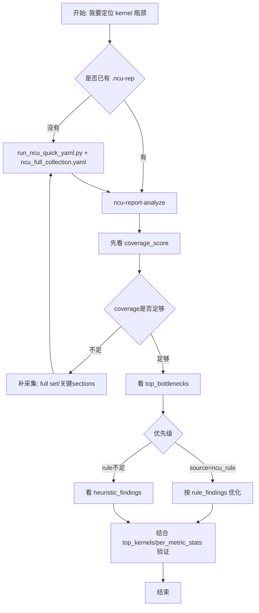

# NCU 快速使用手册

这份 README 的目标是：你看一眼就知道该跑哪条命令。

## 30秒流程图



## 先选场景

1. 我想先跑通 NCU（最小配置）
2. 我想做“完整瓶颈定位”采集（推荐）
3. 我想改所有 NCU 参数
4. 我有 `.ncu-rep`，想直接拿瓶颈结论
5. 我有 CSV，想做指标统计
6. 我想确认参数与分析是否完整

## 场景 -> 直接命令

### 1) 最小配置先跑通

```bash
python my_utils/profiling/ncu/run_ncu_quick_yaml.py \
  --config my_utils/profiling/ncu/ncu_quick_launch.yaml
```

作用：快速验证 `ncu` 采集链路可用。

### 2) 训练场景完整采集（推荐默认）

```bash
python my_utils/profiling/ncu/run_ncu_quick_yaml.py \
  --config my_utils/profiling/ncu/ncu_full_collection.yaml
```

作用：优先保证后续瓶颈分析完整（rules + coverage + fallback heuristics）。

覆盖命令（不改 YAML、临时替换训练命令）：

```bash
python my_utils/profiling/ncu/run_ncu_quick_yaml.py \
  --config my_utils/profiling/ncu/ncu_full_collection.yaml -- \
  torchrun --nproc_per_node=8 pretrain_gpt.py --config cfg.yaml
```

### 3) 全量参数模板（按官方分类）

```bash
python my_utils/profiling/ncu/run_ncu_quick_yaml.py \
  --config my_utils/profiling/ncu/ncu_2026_1_1_full_args.yaml
```

作用：你可以在一个 YAML 里管理几乎所有 NCU 参数（含注释）。

## 有报告后怎么分析

### 4) `.ncu-rep` 直读分析（推荐）

列出可用技能：

```bash
myutils-profile ncu-report-skill --report ./run.ncu-rep --list-skills --pretty
```

直接给结论：

```bash
myutils-profile ncu-report-analyze --report ./run.ncu-rep --top-k 20 --pretty
```

只看瓶颈报告：

```bash
myutils-profile ncu-report-skill --report ./run.ncu-rep --skill bottleneck_report --param top_k=10 --pretty
```

作用：输出 `rule_results + bottleneck_report + coverage`，用于快速定位瓶颈类别。

按 Codex NCU workflow 看六维诊断：

```bash
myutils-profile ncu-report-skill --report ./run.ncu-rep --skill dimension_report --param top_k=10 --pretty
```

作用：按 occupancy/launch、tail effect、stall、tensor core、PM sampling timeline、memory/cache 六个维度输出证据和下一步动作。H100/sm_90 和 B200/sm_100 常见 metric 命名都会做兼容解析。

### 5) CSV 分析（你已有导出 CSV 时）

```bash
myutils-profile ncu-csv-skill --csv ./ncu_raw.csv --list-skills --pretty
myutils-profile ncu-csv-analyze --csv ./ncu_raw.csv --top-k 20 --pretty
```

作用：做行级统计、metric 分位、top kernels 等轻量分析。

## 看结果时优先看什么

1. `coverage.coverage_score`: 是否采够关键维度指标。  
2. `top_bottlenecks`: 优先看 `source=ncu_rule`。  
3. `dimension_report`: 对照六维诊断，确认 small grid、tail、stall、tensor core、PM sampling、memory/cache 哪一类最可疑。
4. `heuristic_findings`: rule 不完整时的 fallback（coalescing/divergence/bank-conflict 等）。
5. `top_kernels + per_metric_stats`: 具体 kernel 与指标证据。

## H100 / B200 兼容说明

- H100/Hopper 会识别 `device__attribute_compute_capability_major=9`、`device__attribute_multiprocessor_count=132` 等信号，输出 `architecture.alias=h100/sm_90`。
- B200/Blackwell 会识别 `compute_capability_major=10` 或 148 SM，输出 `architecture.alias=b200/sm_100`。
- 对 H100 常见旧命名和 B200 新命名都做了 alias，例如：
  - `smsp__inst_executed_op_*` 与 `smsp__sass_inst_executed_op_*`
  - 直接的 `l1tex__average_t_sectors_per_request_pipe_lsu_mem_global_op_ld.ratio`
  - 由 `l1tex__t_sectors...sum / l1tex__t_requests...sum` 推导的 sectors/request

## 关键文件说明

- `run_ncu_quick_yaml.py`: NCU YAML 启动器
- `ncu_quick_launch.yaml`: 最小模板
- `ncu_full_collection.yaml`: 训练完整采集模板（推荐）
- `ncu_2026_1_1_full_args.yaml`: 全量参数模板
- `ncu_report_tools.py`: `.ncu-rep` 解析和瓶颈分析
- `ncu_csv_tools.py`: CSV 解析和统计
- `ncu_2026_1_1_cli_quick_reference.md`: 参数分类索引
- `NCU_ANALYSIS_COMPLETENESS_AUDIT_2026_04_19.md`: 完整性审计结果

## 参数与分析完整性

- 官方参数对齐结果：`Command Line Options` 官方表 111 项，本地模板官方项 111 项，missing=0。
- 兼容/历史补充项也已加到全量模板（例如 `communicator-shmem-num-peers`、`details-all`）。

建议：日常直接用 `ncu_full_collection.yaml`，要深度调参再切 `ncu_2026_1_1_full_args.yaml`。
