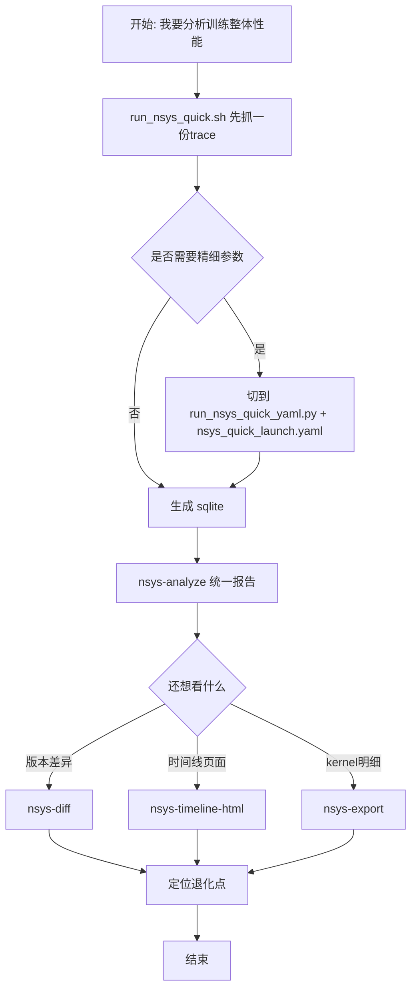

# NSYS 快速使用手册

这份 README 只做一件事：让你按需求秒选命令。

## 30秒流程图



## 先选场景

1. 我想快速抓训练全局时间线
2. 我想用 YAML 配置 NSYS 参数
3. 我想只抓训练过程某一段（capture range）
4. 我已经有 sqlite，想做离线分析
5. 我想对比两次训练
6. 我想出 timeline HTML

## 场景 -> 直接命令

### 1) 快速抓训练全局时间线（最常用）

```bash
bash my_utils/profiling/templates/run_nsys_quick.sh -- python train.py --config cfg.yaml
```

作用：给你的训练命令外层自动加 `nsys profile`，快速产出 profile 文件。

### 2) 用 YAML 管理参数（推荐长期用）

```bash
python my_utils/profiling/templates/run_nsys_quick_yaml.py \
  --config my_utils/profiling/templates/nsys_quick_launch.yaml
```

作用：通过 YAML 统一管理参数，不用改脚本。

全量参数模板：

```bash
python my_utils/profiling/templates/run_nsys_quick_yaml.py \
  --config my_utils/profiling/templates/nsys_2026_2_full_args.yaml
```

### 3) 只抓某一段训练（capture range + 手动 stop）

启动（不自动结束）：

```bash
python my_utils/profiling/templates/run_nsys_quick_yaml.py \
  --config /path/to/profile.yaml -- \
  torchrun --nproc_per_node=8 --no_python python train.py
```

`profile.yaml` 关键字段：

```yaml
nsys_launch:
  capture_range: cudaProfilerApi
  capture_range_end: none
  extra_profile_args:
    - --session-new=my_train_sess
    - --flush-on-cudaprofilerstop=false
```

结束采集：

```bash
nsys stop --session=my_train_sess
```

作用：适合只看训练中间某段，避免抓全程超大文件。

### 4) 已有 sqlite，直接做统一分析

```bash
myutils-profile nsys-analyze --sqlite ./train_rank0.sqlite --output ./nsys_analyze.json
```

作用：输出 summary/overlap/nccl/iteration/mfu 等聚合结果。

### 5) 对比两次训练（定位退化）

```bash
myutils-profile nsys-diff \
  --before-sqlite ./before.sqlite \
  --after-sqlite ./after.sqlite \
  --output ./diff.json
```

作用：比较 kernel/nvtx 变化，快速定位性能回退。

### 6) 导出时间线与明细

导出 kernel 明细：

```bash
myutils-profile nsys-export --sqlite ./train_rank0.sqlite --format csv --output ./kernels.csv
```

导出 timeline HTML：

```bash
myutils-profile nsys-timeline-html --sqlite ./train_rank0.sqlite --output ./timeline.html
```

## 常见训练框架写法（可直接包裹）

Megatron-LM:

```bash
bash my_utils/profiling/templates/run_nsys_quick.sh -- \
  torchrun ... --no_python python pretrain_gpt.py ...
```

DeepSpeed:

```bash
bash my_utils/profiling/templates/run_nsys_quick.sh -- \
  deepspeed --num_gpus=8 train.py ...
```

Hugging Face Trainer / Accelerate:

```bash
bash my_utils/profiling/templates/run_nsys_quick.sh -- \
  accelerate launch ... train.py ...
```

VERL:

```bash
bash my_utils/profiling/templates/run_nsys_quick.sh -- \
  python -m verl.trainer.main_ppo ...
```

SLIME / Ray:

```bash
bash my_utils/profiling/templates/run_nsys_quick.sh -- \
  ray job submit ... -- python3 train.py ...
```

## 你主要会改的文件

- `run_nsys_quick.sh`: 最快入口
- `run_nsys_quick_yaml.py`: YAML 启动器
- `nsys_quick_launch.yaml`: 最小模板
- `nsys_2026_2_full_args.yaml`: 全参数模板
- `preset_nsys_default.env`: 常用采集预设

## 一句话建议

先用 `run_nsys_quick.sh` 跑通，再切到 `nsys_quick_launch.yaml` 固化参数，最后用 `nsys-analyze` / `nsys-diff` 做稳定分析。
