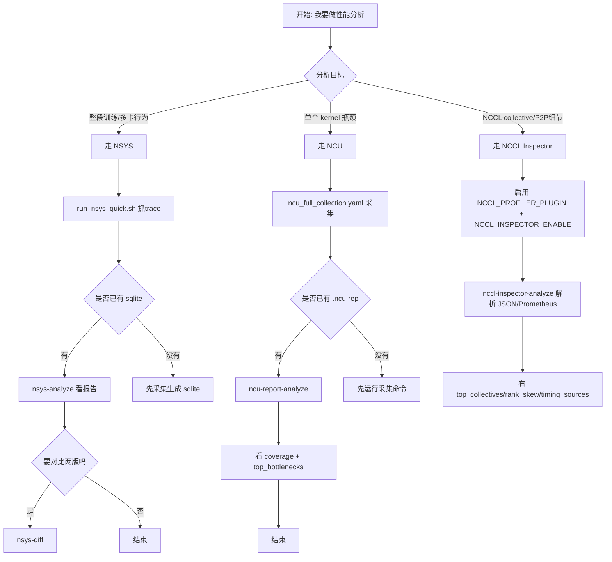

# Profiling Quick Guide

你只需要先回答一个问题：你现在要看“整段训练行为”还是“单个 kernel 细节”。

- `nsys`：看训练全局时间线、通信/计算重叠、迭代耗时、跨版本对比。
- `ncu`：看单 kernel 的瓶颈（SM/DRAM/occupancy/stall/rules）。
- `nccl-inspector`：看 NCCL profiler plugin 输出的 collective/P2P 带宽、耗时、rank skew。

## 30秒流程图



## 一眼选命令（按需求）

1. 我要先抓一份训练整体 trace（推荐先做）

```bash
bash my_utils/profiling/templates/run_nsys_quick.sh -- python train.py --config cfg.yaml
```

说明：一键把你的训练命令包上 `nsys profile`，产出 `.nsys-rep/.sqlite`。

2. 我想用 YAML 管理 NSYS 参数

```bash
python my_utils/profiling/templates/run_nsys_quick_yaml.py \
  --config my_utils/profiling/templates/nsys_quick_launch.yaml
```

说明：改 YAML 即可，不用改脚本。

3. 我已经有 NSYS sqlite，想直接看分析结果

```bash
myutils-profile nsys-analyze --sqlite ./train_rank0.sqlite --output ./nsys_analyze.json
```

说明：输出统一分析报告（summary/overlap/nccl/iteration/mfu 等）。

4. 我想对比两次训练差异

```bash
myutils-profile nsys-diff --before-sqlite ./a.sqlite --after-sqlite ./b.sqlite --output ./diff.json
```

说明：对比 kernel/nvtx 聚合差异，定位退化来源。

5. 我想看单个 kernel 瓶颈（NCU）

```bash
python my_utils/profiling/ncu/run_ncu_quick_yaml.py \
  --config my_utils/profiling/ncu/ncu_full_collection.yaml
```

说明：这是 NCU 诊断优先模板，采集维度最完整。

6. 我已经有 `.ncu-rep`，直接要瓶颈结论

```bash
myutils-profile ncu-report-analyze --report ./run.ncu-rep --top-k 20 --pretty
```

说明：输出 `rule_results + bottleneck_report + coverage`。

7. 我已经有 NCCL Inspector dump，想看通信明细

```bash
myutils-profile nccl-inspector-analyze --input ./nccl-inspector-logs --top-k 20 --pretty
```

说明：解析 NCCL profiler plugin 的 Inspector JSON/JSONL 输出，汇总 collective/P2P、带宽、耗时、rank skew。

## 常用配置文件

- NSYS 快速模板：`my_utils/profiling/templates/nsys_quick_launch.yaml`
- NSYS 全量参数模板：`my_utils/profiling/templates/nsys_2026_2_full_args.yaml`
- NCU 快速模板：`my_utils/profiling/ncu/ncu_quick_launch.yaml`
- NCU 训练全覆盖模板：`my_utils/profiling/ncu/ncu_full_collection.yaml`
- NCU 全量参数模板：`my_utils/profiling/ncu/ncu_2026_1_1_full_args.yaml`
- NCCL Inspector 文档：`my_utils/profiling/nccl/README.md`

## 深入文档入口

- NSYS：`my_utils/profiling/templates/README.md`
- NCU：`my_utils/profiling/ncu/README.md`
- 设计与文档索引：`my_utils/profiling/docs/README.md`
- 跨框架实战指南（TorchTitan/Megatron/DeepSpeed/HF/VERL/SLIME/ROLL/SGLang/vLLM）：`my_utils/profiling/docs/FRAMEWORK_INTEGRATION_PLAYBOOK_ZH.md`
- 跨框架可运行样例：`my_utils/profiling/examples/framework_playbook_samples/README.md`
