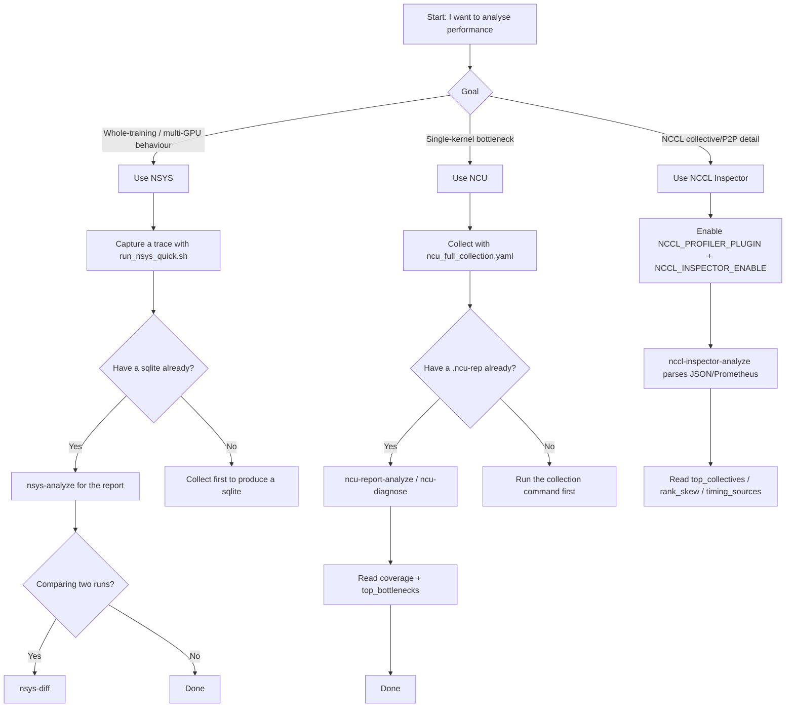

# Profiling

> **Full handbook:** [`docs/PERFORMANCE_ANALYSIS_HANDBOOK.md`](docs/PERFORMANCE_ANALYSIS_HANDBOOK.md)
> — how to collect every nsys/ncu metric that matters and turn it into a
> diagnosis. This page is the quick map; the handbook is authoritative.

Start by answering one question: do you want to look at **whole-training
behaviour** or **single-kernel detail**?

- `nsys`: whole-training timeline, compute/communication overlap, iteration
  time, cross-run comparison.
- `ncu`: single-kernel bottlenecks (SM/DRAM/occupancy/stalls/rules).
- `nccl-inspector`: collective/P2P bandwidth, latency and rank skew from the
  NCCL profiler plugin output.

## The 30-second decision tree



## Read `coverage` before `findings`

The single most important habit with this tool. An analysis that never ran —
because its metric section was not collected — produces exactly what a healthy
analysis produces: nothing. Every analyzer therefore reports which analyses
ran and which could not, and why. Read that first; two findings can mean two
problems, or two problems plus nine questions nobody asked. Missing coverage
is not a clean result.

## Subpackage map

| Subpackage | What it is |
|---|---|
| [`analyzers/`](analyzers/) | Cross-source analysis: top-down nsys triage decision tree, workload-aware rules, NCCL bandwidth models, rank alignment/skew, trace-quality checks. |
| [`ncu/`](ncu/) | Nsight Compute: collection presets (YAML), the metric catalog with per-architecture spellings, and the evidence-based kernel rule engine behind `ncu-diagnose`. |
| [`sources/`](sources/) | Nsight Systems: SQLite parsing, SQL skills, kernel-name taxonomy, iteration/MFU/diff/timeline exporters. |
| [`hardware/`](hardware/) | GPU capability tables (dense peaks, ridge points) and clock-throttling detection. |
| [`metrics/`](metrics/) | The canonical `MetricEvent` schema, providers and storage for the unified metrics pipeline. |
| [`runtime/`](runtime/) | In-process profiler control: capture windows, backends, framework-less operation. |
| [`adapters/`](adapters/) | Framework integrations (PyTorch, Megatron, DeepSpeed, HuggingFace, TorchTitan, VERL, SLIME, ROLL, SGLang, vLLM) that auto-register capture providers. |
| [`visualization/`](visualization/) | HTML report generation: charts, layouts, timeline pages. |
| [`nccl/`](nccl/) | NCCL Inspector plugin output: parsing and collective/P2P summaries. |
| [`templates/`](templates/) | Ready-to-run nsys launch scripts and YAML configs. |
| [`pipeline/`](pipeline/) | The config-driven `MetricsCollector` that ties providers, analysis and reports together. |
| [`docs/`](docs/) | The handbook, design docs and reference material — index at [`docs/README.md`](docs/README.md). |

## Pick a command by need

1. Capture a whole-training trace (do this first):

```bash
bash my_utils/profiling/templates/run_nsys_quick.sh -- python train.py --config cfg.yaml
```

2. Already have an nsys sqlite — analyse it:

```bash
myutils-profile nsys-analyze --sqlite ./train_rank0.sqlite --output ./nsys_analyze.json
```

3. Compare two runs:

```bash
myutils-profile nsys-diff --before-sqlite ./a.sqlite --after-sqlite ./b.sqlite --output ./diff.json
```

4. Collect single-kernel detail (NCU, diagnosis-first preset):

```bash
python my_utils/profiling/ncu/run_ncu_quick_yaml.py \
  --config my_utils/profiling/ncu/ncu_full_collection.yaml
```

5. Already have a `.ncu-rep` — get the bottleneck verdict:

```bash
myutils-profile ncu-diagnose --report ./run.ncu-rep --gpu "H100 SXM5" --format md
myutils-profile ncu-report-analyze --report ./run.ncu-rep --top-k 20 --pretty
```

6. Already have NCCL Inspector dumps — get communication detail:

```bash
myutils-profile nccl-inspector-analyze --input ./nccl-inspector-logs --top-k 20 --pretty
```

## Common config files

- NSYS quick template: [`templates/nsys_quick_launch.yaml`](templates/nsys_quick_launch.yaml)
- NSYS full-args template: [`templates/nsys_2026_2_full_args.yaml`](templates/nsys_2026_2_full_args.yaml)
- NCU quick template: [`ncu/ncu_quick_launch.yaml`](ncu/ncu_quick_launch.yaml)
- NCU full-coverage training template: [`ncu/ncu_full_collection.yaml`](ncu/ncu_full_collection.yaml)
- NCU full-args template: [`ncu/ncu_2026_1_1_full_args.yaml`](ncu/ncu_2026_1_1_full_args.yaml)
- NCCL Inspector docs: [`nccl/README.md`](nccl/README.md)

## Going deeper

- The handbook: [`docs/PERFORMANCE_ANALYSIS_HANDBOOK.md`](docs/PERFORMANCE_ANALYSIS_HANDBOOK.md)
- Capability overview: [`docs/CAPABILITY_EVOLUTION.md`](docs/CAPABILITY_EVOLUTION.md)
- Unified metrics pipeline: [`docs/UNIFIED_PROFILING_QUICKSTART.md`](docs/UNIFIED_PROFILING_QUICKSTART.md)
- NSYS templates: [`templates/README.md`](templates/README.md)
- NCU presets: [`ncu/README.md`](ncu/README.md)
- Docs index: [`docs/README.md`](docs/README.md)
