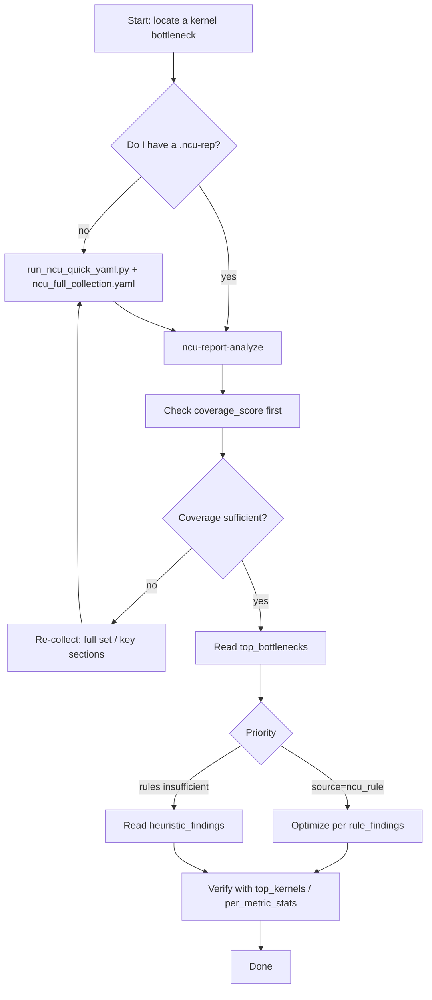

# NCU quick guide

Goal: glance at this page and know which command to run. Capture requires an
`ncu`-capable GPU environment; report/CSV analysis is offline and pure Python.

## 30-second flow



## Pick a scenario

1. Get NCU running with a minimal config.
2. Full bottleneck-oriented collection (recommended).
3. Tune every NCU parameter.
4. Already have a `.ncu-rep`; get conclusions directly.
5. Already have a CSV; get metric statistics.
6. Verify parameter and analysis completeness.

## Scenario -> command

### 1) Minimal config

```bash
python my_utils/profiling/ncu/run_ncu_quick_yaml.py \
  --config my_utils/profiling/ncu/ncu_quick_launch.yaml
```

Quickly verifies that the `ncu` collection chain works.

### 2) Full training collection (recommended default)

```bash
python my_utils/profiling/ncu/run_ncu_quick_yaml.py \
  --config my_utils/profiling/ncu/ncu_full_collection.yaml
```

Prioritizes complete downstream bottleneck analysis (rules + coverage +
fallback heuristics).

Override the training command without editing the YAML:

```bash
python my_utils/profiling/ncu/run_ncu_quick_yaml.py \
  --config my_utils/profiling/ncu/ncu_full_collection.yaml -- \
  torchrun --nproc_per_node=8 pretrain_gpt.py --config cfg.yaml
```

### 3) Full parameter template (official categories)

```bash
python my_utils/profiling/ncu/run_ncu_quick_yaml.py \
  --config my_utils/profiling/ncu/ncu_2026_1_1_full_args.yaml
```

Manage nearly every NCU parameter (with comments) in one YAML.

## Analyzing an existing report

### 4) Direct `.ncu-rep` analysis (recommended)

```bash
# list available skills
myutils-profile ncu-report-skill --report ./run.ncu-rep --list-skills --pretty

# conclusions directly
myutils-profile ncu-report-analyze --report ./run.ncu-rep --top-k 20 --pretty

# bottleneck report only
myutils-profile ncu-report-skill --report ./run.ncu-rep --skill bottleneck_report --param top_k=10 --pretty
```

Outputs `rule_results + bottleneck_report + coverage` for quick bottleneck
classification.

Six-dimension diagnosis:

```bash
myutils-profile ncu-report-skill --report ./run.ncu-rep --skill dimension_report --param top_k=10 --pretty
```

Reports evidence and next actions along six axes: occupancy/launch, tail
effect, stalls, tensor core, PM sampling timeline, memory/cache. Common
H100/sm_90 and B200/sm_100 metric names are both parsed.

Related subcommands: `ncu-diagnose` (per-kernel bottleneck class, stalls,
roofline, fixes) and `ncu-metrics` (explain any NCU metric, search the index,
report catalog coverage).

### 5) CSV analysis (when you already exported a CSV)

```bash
myutils-profile ncu-csv-skill --csv ./ncu_raw.csv --list-skills --pretty
myutils-profile ncu-csv-analyze --csv ./ncu_raw.csv --top-k 20 --pretty
```

Lightweight row-level statistics, metric quantiles, top kernels.

## What to read first in the results

1. `coverage.coverage_score` — did the collection cover the key dimensions?
2. `top_bottlenecks` — prefer entries with `source=ncu_rule`.
3. `dimension_report` — which of the six axes (small grid, tail, stall,
   tensor core, PM sampling, memory/cache) is most suspect.
4. `heuristic_findings` — fallback when rules are incomplete (coalescing /
   divergence / bank conflicts, ...).
5. `top_kernels` + `per_metric_stats` — concrete kernels and metric evidence.

## H100 / B200 compatibility

- H100/Hopper is recognized from signals such as
  `device__attribute_compute_capability_major=9` or 132 SMs; the report shows
  `architecture.alias=h100/sm_90`.
- B200/Blackwell is recognized from `compute_capability_major=10` or 148 SMs;
  the report shows `architecture.alias=b200/sm_100`.
- Aliases cover both the older H100 naming and the newer B200 naming, e.g.:
  - `smsp__inst_executed_op_*` vs `smsp__sass_inst_executed_op_*`
  - direct `l1tex__average_t_sectors_per_request_pipe_lsu_mem_global_op_ld.ratio`
  - sectors/request derived from `l1tex__t_sectors...sum / l1tex__t_requests...sum`

## Key files

- `run_ncu_quick_yaml.py` — NCU YAML launcher.
- `ncu_quick_launch.yaml` — minimal template.
- `ncu_full_collection.yaml` — full training-collection template (recommended).
- `ncu_2026_1_1_full_args.yaml` — full parameter template.
- `ncu_report_tools.py` — `.ncu-rep` parsing and bottleneck analysis.
- `ncu_csv_tools.py` — CSV parsing and statistics.
- `ncu_diagnostics.py`, `metric_catalog.py`, `shipped_rules.py`,
  `section_index.py`, `sampling_validity.py`, `signal_scan.py`,
  `source_correlation.py` — diagnosis engine internals.
- `ncu_2026_1_1_cli_quick_reference.md` — parameter category index.
- `NCU_ANALYSIS_COMPLETENESS_AUDIT_2026_04_19.md` — completeness audit.

## Parameter and analysis completeness

- Alignment against the official `Command Line Options` table: 111 official
  entries, 111 present in the local template, missing = 0.
- Compatibility/legacy extras (e.g. `communicator-shmem-num-peers`,
  `details-all`) are included in the full template as well.

Recommendation: use `ncu_full_collection.yaml` day to day; switch to
`ncu_2026_1_1_full_args.yaml` only for deep parameter tuning.

---

Chinese original: [docs/zh/profiling/ncu/README.md](../../../docs/zh/profiling/ncu/README.md)
