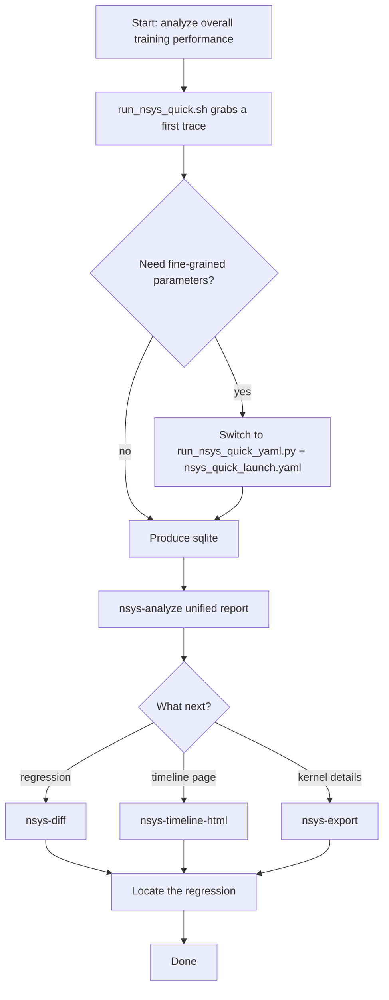

# NSYS quick guide

One purpose: pick the right command for your need in seconds. Capture requires
an `nsys`-capable environment; the offline analysis commands are pure Python.

## 30-second flow



## Pick a scenario

1. Quickly capture a full training timeline.
2. Manage NSYS parameters via YAML.
3. Capture only a slice of training (capture range).
4. Already have a sqlite; run offline analysis.
5. Compare two training runs.
6. Produce a timeline HTML page.

## Scenario -> command

### 1) Quick full-timeline capture (most common)

```bash
bash my_utils/profiling/templates/run_nsys_quick.sh -- python train.py --config cfg.yaml
```

Wraps your training command with `nsys profile` automatically.

### 2) YAML-managed parameters (recommended long-term)

```bash
python my_utils/profiling/templates/run_nsys_quick_yaml.py \
  --config my_utils/profiling/templates/nsys_quick_launch.yaml
```

Full parameter template:

```bash
python my_utils/profiling/templates/run_nsys_quick_yaml.py \
  --config my_utils/profiling/templates/nsys_2026_2_full_args.yaml
```

### 3) Capture only a slice (capture range + manual stop)

Launch (does not end automatically):

```bash
python my_utils/profiling/templates/run_nsys_quick_yaml.py \
  --config /path/to/profile.yaml -- \
  torchrun --nproc_per_node=8 --no_python python train.py
```

Key fields in `profile.yaml`:

```yaml
nsys_launch:
  capture_range: cudaProfilerApi
  capture_range_end: none
  extra_profile_args:
    - --session-new=my_train_sess
    - --flush-on-cudaprofilerstop=false
```

Stop the capture:

```bash
nsys stop --session=my_train_sess
```

Useful when you only care about a segment of training and want to avoid a
huge full-run trace.

### 4) Already have a sqlite: unified analysis

```bash
myutils-profile nsys-analyze --sqlite ./train_rank0.sqlite --output ./nsys_analyze.json
```

Outputs summary/overlap/nccl/iteration/mfu aggregates.

### 5) Compare two runs (find regressions)

```bash
myutils-profile nsys-diff \
  --before-sqlite ./before.sqlite \
  --after-sqlite ./after.sqlite \
  --output ./diff.json
```

### 6) Export timeline and details

```bash
myutils-profile nsys-export --sqlite ./train_rank0.sqlite --format csv --output ./kernels.csv
myutils-profile nsys-timeline-html --sqlite ./train_rank0.sqlite --output ./timeline.html
```

## Common framework wrappers

Megatron-LM:

```bash
bash my_utils/profiling/templates/run_nsys_quick.sh -- \
  torchrun ... --no_python python pretrain_gpt.py ...
```

DeepSpeed:

```bash
bash my_utils/profiling/templates/run_nsys_quick.sh -- \
  deepspeed --num_gpus=8 train.py ...
```

Hugging Face Trainer / Accelerate:

```bash
bash my_utils/profiling/templates/run_nsys_quick.sh -- \
  accelerate launch ... train.py ...
```

VERL:

```bash
bash my_utils/profiling/templates/run_nsys_quick.sh -- \
  python -m verl.trainer.main_ppo ...
```

SLIME / Ray:

```bash
bash my_utils/profiling/templates/run_nsys_quick.sh -- \
  ray job submit ... -- python3 train.py ...
```

Per-framework copy-paste templates live in
`../examples/framework_playbook_samples/`.

## Files you will mostly touch

- `run_nsys_quick.sh` — fastest entry point.
- `run_nsys_quick_yaml.py` — YAML launcher.
- `nsys_quick_launch.yaml` — minimal template.
- `nsys_2026_2_full_args.yaml` — full parameter template.
- `preset_nsys_default.env` — common capture presets (see also
  `preset_torch_profiler.env`, `preset_disabled.env`).
- `run_nsys_analyze.sh`, `run_nsys_diff.sh`, `run_nsys_export.sh`,
  `run_nsys_sql_skill.sh`, `run_nsys_timeline_html.sh`,
  `run_nsys_full_postprocess.sh` — offline post-processing wrappers.

## One-line advice

Get a first trace with `run_nsys_quick.sh`, then pin parameters in
`nsys_quick_launch.yaml`, and rely on `nsys-analyze` / `nsys-diff` for stable
analysis.

---

Chinese original: [docs/zh/profiling/templates/README.md](../../../docs/zh/profiling/templates/README.md)
